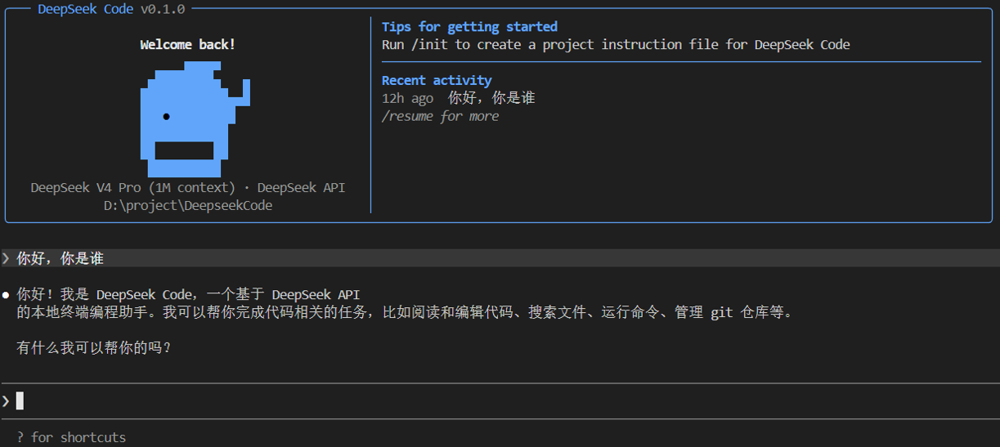

# DeepSeekCode

[简体中文](README.md) | [English](README_EN.md)

基于 Claude Code 代码库改造的本地 CLI 编程代理，将模型请求路由到 DeepSeek 的 Anthropic 兼容 API。

> 社区独立 fork，非 DeepSeek 或 Anthropic 官方产品。



## 功能特性

- 项目感知对话，支持工具执行和权限确认
- **Thinking 推理模式**，可配置推理等级（low / high / max）
- 文件编辑、子代理、MCP 支持、`-p` 非交互模式
- 1M 上下文窗口，最大 384K 输出 token
- 本地配置隔离至 `.deepseek-code` 目录

## 快速开始

通过 npm 全局安装：

```bash
npm install -g @qingj/deepseekcode
```

设置 DeepSeek API key：

```bash
export DEEPSEEK_API_KEY="sk-..."
```

Windows CMD：

```cmd
setx DEEPSEEK_API_KEY "sk-..."
```

重新打开终端后，在任意项目目录运行：

```bash
cd /path/to/your/project
deepseekcode
```

也可以使用等价命令：

```bash
deepseek-code
```

一次性命令模式：

```bash
deepseek-code -p "总结这个仓库"
```

## 源码构建

```bash
git clone https://github.com/QingJ01/DeepSeekCode.git
cd DeepSeekCode
npm ci --ignore-scripts
npm run check
```

本地源码运行：

```bash
node scripts/run-deepseek.mjs
```

## 模型别名

| 别名 | DeepSeek 模型 |
|------|--------------|
| `pro` | `deepseek-v4-pro` |
| `flash` | `deepseek-v4-flash` |

旧版 Claude 别名（`sonnet`、`opus`、`haiku`、`best`）仍然兼容可用。

## 文档

| 文档 | 内容 |
|------|------|
| [快速开始](docs/getting-started.md) | 安装、首次运行、API key 设置 |
| [配置参考](docs/configuration.md) | 环境变量、模型别名、settings.json |
| [使用指南](docs/usage.md) | 交互模式、CLI 参数、斜杠命令、工具 |
| [推理模式](docs/thinking-and-effort.md) | Thinking 模式、Effort 等级、输出限制 |
| [MCP 与高级功能](docs/mcp-and-advanced.md) | MCP 服务、子代理、Hooks、Worktree、CI/CD |
| [架构与开发](docs/architecture.md) | 项目结构、构建流程、适配层原理、开发指南 |
| [常见问题](docs/faq.md) | 故障排除、兼容性、常见问题 |

## 工作原理

- 通过 Anthropic SDK 将 API 调用路由到 DeepSeek 适配层
- 默认开启 Thinking 推理模式，effort 等级为 `max`
- Thinking 模式下 temperature 被服务端忽略（非 thinking 模式支持 0.0-2.0）
- 自动前缀缓存由 DeepSeek 服务端处理，工具定义按字典序排列以最大化缓存命中
- 费用以人民币（¥）显示，`/cost` 命令展示缓存命中率和节省金额
- 将不支持的内容块（image、document、server-tool）转为文本占位
- 子代理继承所有 DeepSeek 环境变量

## 构建

```bash
npm run build
```

生成目录（`dist/`、`build-src/`）已被 git 忽略。

## 贡献

欢迎提交 Issue 和 Pull Request。开发流程：

```bash
git clone https://github.com/QingJ01/DeepSeekCode.git
cd DeepSeekCode
npm ci --ignore-scripts
npm run check          # 构建并验证
npm test               # 运行测试套件
```

详见 [架构与开发指南](docs/architecture.md)。

## 许可

[MIT](LICENSE)

## 友情链接

- [LINUX DO](https://linux.do)
